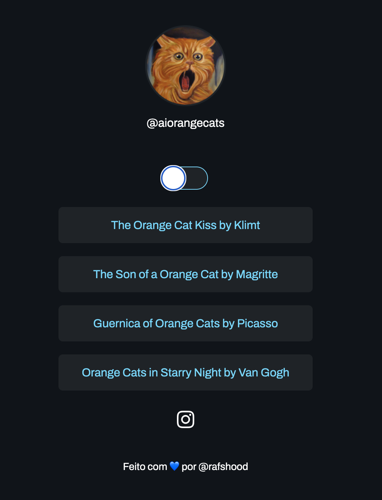

# @aiorangecats - Artistic Interpretations of Famous Paintings with Orange Cats

 

## Overview

This project is a collection of artistic interpretations where orange cats take the center stage in some of the most celebrated paintings of all time. From the romantic embrace of "The Orange Cat Kiss by Klimt" to the swirling skies of "Orange Cats in Starry Night by Van Gogh", this project aims to bring a feline twist to classic art. Made with Dall-E.

## Features

- **The Orange Cat Kiss by Klimt:** A feline take on Gustav Klimt's "The Kiss".
- **The Son of a Orange Cat by Magritte:** René Magritte's surrealist painting gets an orange cat makeover.
- **Guernica of Orange Cats by Picasso:** Witness the chaos of Picasso's Guernica, now featuring orange cats.
- **Orange Cats in Starry Night by Van Gogh:** The serene night sky of Van Gogh's masterpiece, filled with curious orange cats.

## Get in Touch

rafaelapittabahiense@gmail.com
